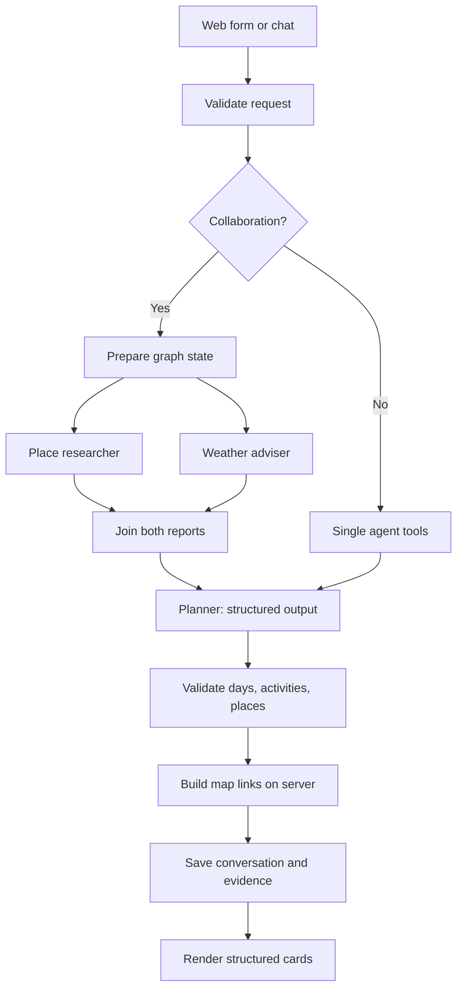

# Architecture

[Back to README](../README.md)

The backend follows the reference architecture by responsibility. Flask remains the web framework, so existing Jinja pages, sessions, and URLs continue to work. LangGraph now manages collaboration. No paid map provider, image API, external agent hosting, or new database server was introduced.

```text
Backend/
  .env.example                 Public configuration template
  .env                         Local credentials (ignored)
  storage/                     Existing SQLite + JSON files (ignored)
  app/
    api/
      main.py                  Flask factory and same-origin write protections
      routes/
        chat.py                Dialogue and planning API
        trip.py                Save/load/feedback and direct planning
        map.py                 Free restaurant search
        pages.py               Existing web pages
        common.py              Shared request/storage helpers
    agents/
      dialogue_agent.py        Bounded conversation/context assembly
      core.py                  Bounded model/tool loop
      collaboration.py         Restricted specialists and planner synthesis
      langchain_model.py       ChatOpenAI boundary and structured-output binding
      prompts.py               Planning instructions
      tools.py                 Allowed provider tools
    graph/
      state.py                 Typed workflow state
      nodes.py                 Prepare, research, synthesize, validate nodes
      workflow.py              LangGraph fan-out / join wiring
    services/                  Maps, weather, source extraction, itinerary formatting
    models/schemas.py          Pydantic request and itinerary models
    rag/
      base/                    Guide loading and embeddings
      pre_data/                FAISS index construction
      retriever/               Vector retrieval
      chain/                   Bounded cached travel-guide retrieval
    memory/
      database.py              SQLite connection lifetime
      conversations.py         Session conversation read/write
      trips.py                 Saved snapshots and feedback
      files.py                 Atomic JSON writes
    middleware/
      request_id.py            Request IDs on responses/errors
      error_handler.py         Consistent, user-safe failures
```

The old `Backend/Agent/`, `Backend/Services/`, `Backend/routes/`, and `Backend/persistence.py` files are import shims for compatibility, not duplicate implementations. New work belongs in `Backend/app/`.

## Planning flow



Each activity has a time period, description, and optional place object with name/city/address. The server constructs Google Maps search URLs from place fields. New cards use these fields directly; old text plans use the legacy renderer. The assistant still has human-readable text for conversation history. Structured itineraries, places, weather, agent reports, and sources stay with their answer and are retained in snapshots.

LangGraph checkpoints are not persisted: this short local workflow completes within one request. SQLite stores completed conversations. Interrupted requests preserve the last completed plan; they are retried rather than resumed from a graph checkpoint.

## API compatibility

Existing `/api/chat`, `/api/conversation`, `/api/planning-status`, `/api/trips`, trip load/feedback, and `/api/restaurants` URLs are unchanged. `POST /api/trips/plan` accepts structured form fields and starts a fresh plan without previous chat history; on success it replaces the active conversation. Writes still require `X-EasyTrip: 1` and a matching origin.

All responses have `X-Request-ID`. JSON errors also include `request_id`. Credentials and runtime storage remain outside Git. The app is still intended for personal local use; there is no authentication or production deployment configuration.

## Retrieval and future extensions

RAG currently uses vector retrieval over Wikivoyage, with at most 16 city indexes cached in memory. Loading, embeddings, indexing, retrieval, and orchestration are separated. BM25/RRF, SQLAlchemy, FastAPI, image search, and persistent graph checkpoints are future options, not installed features.


### Integrated sightseeing and meals

The main planner now researches restaurants with the same free OpenStreetMap
service used by Find food. Both single-agent and collaborating-agent modes can
call `search_restaurants` near researched sights. The Place researcher handles
sightseeing and food together; no additional specialist or paid provider is added.
Full-day plans request Lunch and Dinner activities with named Google Maps links.
The main form has Food & dietary needs; the direct planning API accepts optional
`food_preferences` (up to 300 characters). Saved plans retain meal activities.
If evidence is missing, the assistant should keep an unnamed meal break and
explain the gap. Dietary tags are incomplete: confirm restrictions, allergens and
opening hours with the venue. Existing saved itineraries are not rewritten;
generate a new plan or ask to add nearby meals to your current plan.
